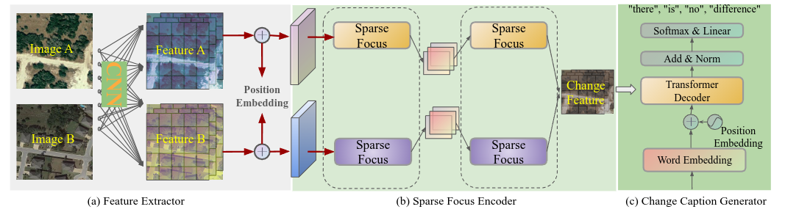
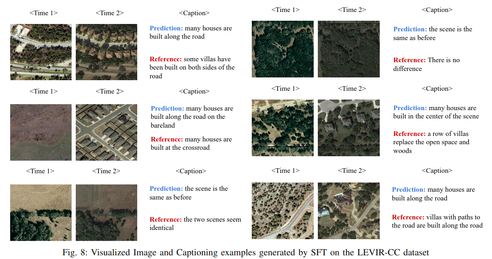
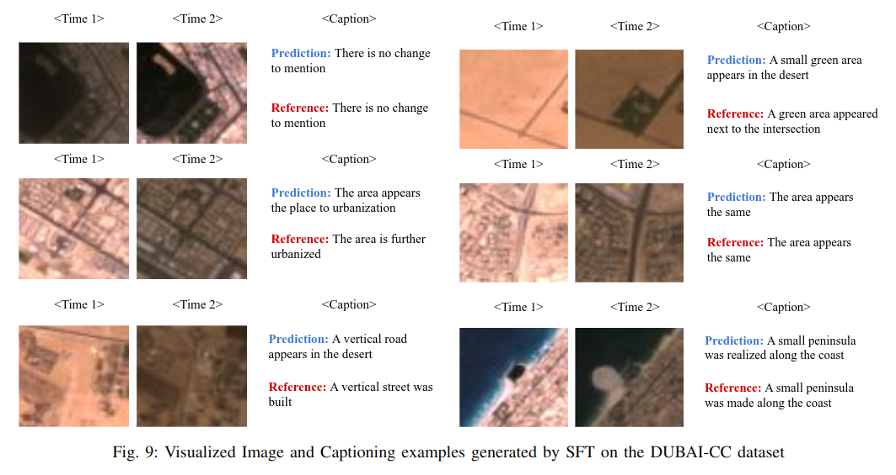

<h1 align="center">A Lightweight Sparse Focus Transformer for
Remote Sensing Image Change Captioning</h1>



    
This is the official PyTorch implementation of **[A Lightweight Sparse Focus Transformer for
Remote Sensing Image Change Captioning](https://arxiv.org/pdf/2405.06598)**.
<!-- a project conducted at the [Institute of Advanced Research in Artificial Intelligence (IARAI)](https://www.iarai.ac.at/). -->


### Preparation
- Install the required packages: `pip install -r requirements.txt`
- Download the remote sensing change captioning datasets. We have adopted [LEVIR-CC](https://github.com/Chen-Yang-Liu/RSICC) in this repository.
- The data structure of LEVIR-CC is organized as follows:

```
├─/root/Data/LEVIR_CC/
        ├─LevirCCcaptions.json
        ├─images
             ├─train
             │  ├─A
             │  ├─B
             ├─val
             │  ├─A
             │  ├─B
             ├─test
             │  ├─A
             │  ├─B
```
where folder A contains images of pre-phase, folder B contains images of post-phase.

- Extract text files for the change descriptions of each image pair in LEVIR-CC:

```
$ python preprocess_data.py
```

!NOTE: When preparing the text token files, we suggest setting the word count threshold of LEVIR-CC to 5 and Dubai_CC to 0 for fair comparisons.
### Training
- Ensure you have completed the data preparation steps above, and then proceed to train the model as follows:
```
$ python train.py
```

!NOTE: If the program encounters the error: "'Meteor' object has no attribute 'lock'," we recommend installing it with `sudo apt install openjdk-11-jdk` to resolve this issue.

### Testing
- After training step, to test the accuracy on test dataset as follows:
```
$ python test.py
```

### Caption Generation
- To generate captions, run the following command:
```
$ python caption.py
```

### Visual Examples


Here are some visualized examples of the generated captions in LEVIR-CC:





### Paper
**[A Lightweight Sparse Focus Transformer for
Remote Sensing Image Change Captioning](https://arxiv.org/pdf/2405.06598)**

Please cite the following paper if you find it useful for your research:

```
@ARTICLE{10700970,
  author={Sun, Dongwei and Bao, Yajie and Liu, Junmin and Cao, Xiangyong},
  journal={IEEE Journal of Selected Topics in Applied Earth Observations and Remote Sensing}, 
  title={A Lightweight Sparse Focus Transformer for Remote Sensing Image Change Captioning}, 
  year={2024},
  volume={17},
  number={},
  pages={18727-18738},
  keywords={Transformers;Feature extraction;Remote sensing;Kernel;Attention mechanisms;Accuracy;Sensors;Convolutional neural networks;Computational modeling;Visualization;Change captioning;remote sensing image change detection;sparse attention;transformer encoder},
  doi={10.1109/JSTARS.2024.3471625}}
```

### Acknowledgement

- The authors would like to thank the contributors to the [LEVIR-CC](https://github.com/Chen-Yang-Liu/RSICC/tree/main) and [Dubai-CC](https://disi.unitn.it/~melgani/datasets.html) datasets.
- The authors would like to thank the work [Chg2cap](https://arxiv.org/abs/2304.01091), [openai/sparse_attention](https://github.com/openai/sparse_attention), [CCNet](https://github.com/speedinghzl/CCNet), [RSICCFormer](https://github.com/Chen-Yang-Liu/RSICC).

### License
This repo is distributed under [MIT License](https://github.com/ShizhenChang/Chg2Cap/blob/main/LICENSE.txt). The code can be used for academic purposes only.
